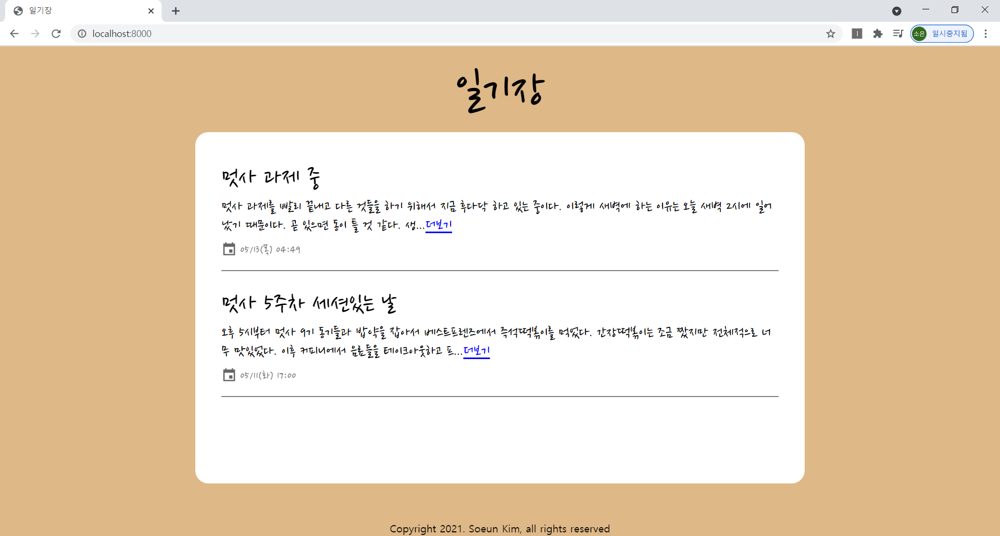
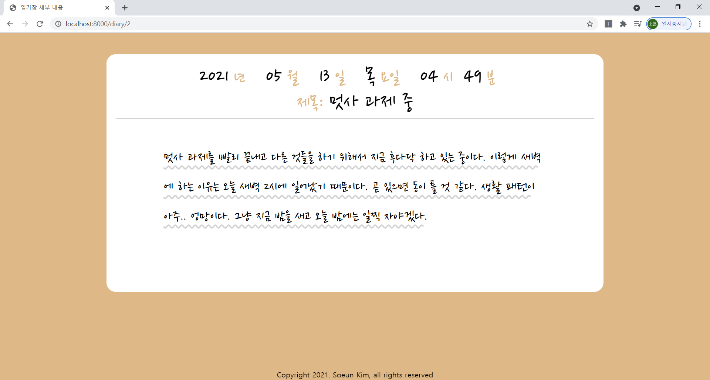
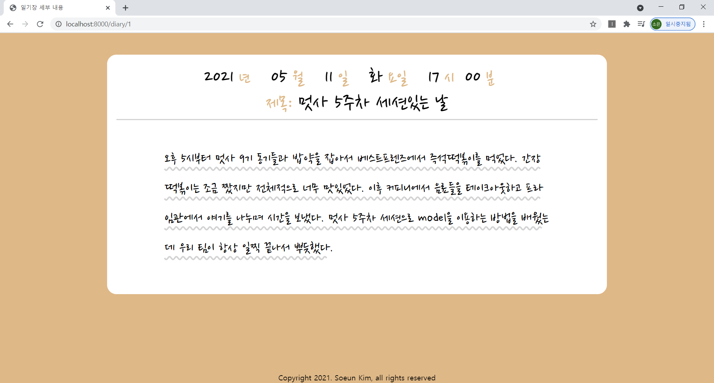

# likelion_week5
LikeLion 5주차 과제-일기장 웹페이지  

  
model을 이용하여 데이터베이스에 저장된 데이터를 웹페이지로 보여줍니다. 일기들은 최신순으로 정렬되어 보입니다.  

  
  
datetimefield를 통해 원하는 데이터만 추출하여 일기장의 날짜를 출력합니다.  

기능  
- Django Model 이용  
- path converter  
- 최신 일기 순으로 정렬  